<!-- profile-version:17 -->

  

---

Jeg startet med en bachelor i sosiologi, der jeg lærte å analysere mønstre, strukturere informasjon og forstå menneskelig atferd. Så byttet jeg til cybersikkerhet, og det viste seg å være en veldig god kombinasjon. Mye av det vi gjør i sikkerhet handler om å forstå menneskene bak angrepene, ikke bare de tekniske mekanismene.

I tillegg til studiene jobber jeg som miljøterapeut i barnevernet. Det trener presisjon under press, klar kommunikasjon og evnen til å dokumentere hendelser nøyaktig. Nøyaktig det samme man trenger i en SOC.

Fra høst 2026 begynner jeg i en deltidsstilling som sikkerhetsanalytiker ved NSM (Nasjonal sikkerhetsmyndighet). Sikkerhetsklarering er under behandling.

---

## Hva jeg jobber med nå

Jeg prøver å bygge ett nytt SOC-verktøy i Python hver hverdag. Log analysis, port scanning, file integrity monitoring, hash identification og mer. Alt ligger i portfolioen under.

Holder på med SC-200 (Microsoft Security Operations Analyst Associate) og planlegger CompTIA Security+ etter det.

---

## Verktøy jeg bruker

  

  
  
  

  
  
  

---

## SOC Projects Portfolio

Ett nytt prosjekt hver hverdag.

| # | Prosjekt | Kategori |
|---|----------|----------|
| 01 | [Brute Force Detector](https://github.com/NourKhalil0/soc-projects/tree/main/01-brute-force-detector) | Log Analysis |
| 02 | [SIEM Log Normalizer](https://github.com/NourKhalil0/soc-projects/tree/main/02-siem-log-normalizer) | SIEM |
| 03 | [Incident Response Playbook](https://github.com/NourKhalil0/soc-projects/tree/main/03-incident-response-playbook) | Incident Response |
| 04 | [URL Phishing Analyser](https://github.com/NourKhalil0/soc-projects/tree/main/04-url-analyser) | Phishing Detection |
| 05 | [Port Scanner](https://github.com/NourKhalil0/soc-projects/tree/main/05-port-scanner) | Network Monitoring |
| 06 | [Hash Identifier](https://github.com/NourKhalil0/soc-projects/tree/main/06-hash-identifier) | Password Security |
| 07 | [DNS Lookup Tool](https://github.com/NourKhalil0/soc-projects/tree/main/07-dns-lookup) | Threat Intel |
| 08 | [Auth Log Analyzer](https://github.com/NourKhalil0/soc-projects/tree/main/08-auth-log-analyzer) | Log Analysis |
| 09 | [File Integrity Monitor](https://github.com/NourKhalil0/soc-projects/tree/main/09-file-integrity-monitor) | Endpoint Security |

👉 [Se hele portfolioen](https://github.com/NourKhalil0/soc-projects)

---

## GitHub statistikk

  
  &nbsp;&nbsp;
  

  

---

## Detaljert oversikt

  
  

  
  

---

## Bidragsormen

  <picture>
    <source media="(prefers-color-scheme: dark)" srcset="https://raw.githubusercontent.com/NourKhalil0/NourKhalil0/output/github-contribution-grid-snake-dark.svg" />
    <source media="(prefers-color-scheme: light)" srcset="https://raw.githubusercontent.com/NourKhalil0/NourKhalil0/output/github-contribution-grid-snake.svg" />
    
  </picture>

---

